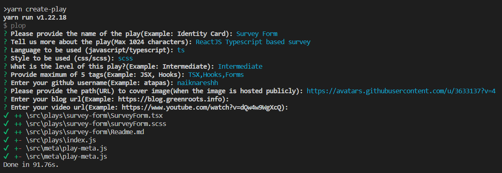

# Create a Play
This document helps you with the steps to `Create a play` in `react-play`. You will also find the details of how to submit a play for code review.
## 🖥️ Steps to Create a Play
Welcome developers! We are as excited as you are to know that you are going to create a new play. It is super easy to get started.

> **Note:** The steps below assumes that you have forked and cloned the [react-play](https://github.com/reactplay/react-play) repository. Also, you have installed the dependencies using the `npm install` or `yarn install` command. If you are new to forking, please watch this [YouTube Guide](https://www.youtube.com/watch?v=h8suY-Osn8Q) to get started.

- Open a command prompt in your project folder.
- Run the following command:
  ```shell
    yarn create-play
    # or
    npm run create-play
  ```
- This will ask a few questions about your `Play` and then perform required steps to create the play. The screen shot below shows the output of the command.
   > **Script Language**: `react-play` is equipped with both `JavaScript` and `TypeScript`. So you can use either of it as base language for your play
   
  <p align="center">
    
  </p>
  
  <details>
    <summary>
      Please expand  to find the description of the question details.
    </summary>
    <p>
      <table>
        <thead>
          <tr>
            <th>Question</th>
            <th>Mandatory</th>
            <th>Description</th>
          </tr>
        </thead>
        <tbody>
          <tr>
            <td>Please provide the name of the play</td>
            <td>Yes</td>
            <td>Please provide a meaningful name of the play(Example: Identity Card). This name will be visible to the users. </td>
          </tr>
          <tr>
            <td>Tell us more about the play</td>
            <td>No</td>
            <td>It is a description of the play for users to understand it better. The maximum number of allowed characters is 1024.</td>
          </tr>
          <tr>
            <td>Language to be used (javascript/typescript)</td>
            <td>Yes</td>
            <td>Let the application know your choice of script. It supports both <b>JavaScript</b> and <b>TypeScript</b>. You can pick either of it.</td>
          </tr>
          <tr>
            <td>Style to be used (css/scss)</td>
            <td>Yes</td>
            <td>Let the application know your choice of style. It supports both <b>css</b> and <b>scss</b>. You can pick either of it.</td>
          </tr>
          <tr>
            <td>What is the level of this play?</td>
            <td>Yes</td>
            <td>You will be asked to select one of the three levels, Beginner, Intermediate, or Advanced. Please select a level for the play. A level indicates the possible complexity of developing the play using React.</td>
          </tr>
          <tr>
            <td>Provide maximum of 5 tags</td>
            <td>No</td>
            <td>Please provide comma-separated list of tags. You can provide max 5 tags. Example: JSX, Hooks</td>
          </tr>
          <tr>
            <td>Enter your github username</td>
            <td>Yes</td>
            <td>Provide your GitHub user name to mark you as the creator of the play.</td>
          </tr>
          <tr>
            <td>Please provide the path(URL) to cover image</td>
            <td>No</td>
            <td>A cover image is used to show your play with a thumbnail in the play list page. Please provide a link a cover image that is publicly accessible using a URL, example:  https://res.cloudinary.com/reactplay/image/upload/v1649060528/demos/id-card_pdvyvz.png. Alternatively, you can have a cover.png file in the root of your play folder.
            If you don't have a cover image, the app will use the default cover image.</td>
          </tr>
          <tr>
            <td>Enter your blog url</td>
            <td>No</td>
            <td>If you have written an article about this play, please provide the link to your blog article page.</td>
          </tr>
          <tr>
            <td>Enter your video url</td>
            <td>No</td>
            <td>If you have created a video tutorial about this play, please provide the link to your YouTube video.</td>
          </tr>
        </tbody>
      </table>
    </p>
  </summary>
</details>

- Now you can run the app using the following command:
  ```shell
    yarn start
    # or
    npm start
  ```
- You should now see your play added to the [play list](http://localhost:3000/plays) page. You can click on the play thumbnail to see the details of the play.

- That's it. Now start coding your `Play` using your favorite code editor!
## 👀 Submitting a Play for Review
After you done with coding for your `Play`, you can submit it for review. Submitting a `Play` for review is a two step process.

- Create a Pull Request on the [react-play](https://github.com/reactplay/react-play) repository with your changes. Please add `atapas` as a reviewer.
- Dedicate some time in a week to take care of the review comments.

Once the Pull Request is approved and merged, we will notify you and add you as a `Contributor` to the [react-play](https://github.com/reactplay/react-play) project.

## ✋ Need Help?

You can reach out to us at [ReactPlay Twitter Handle | @ReactPlayIO](https://twitter.com/ReactPlayIO) with a DM. Additionally, feel free to open a [discussion](https://github.com/reactplay/react-play/discussions) or [issue](https://github.com/reactplay/react-play/issues) on the `react-play` repository.
